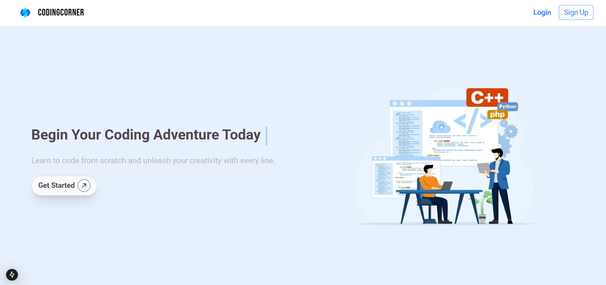
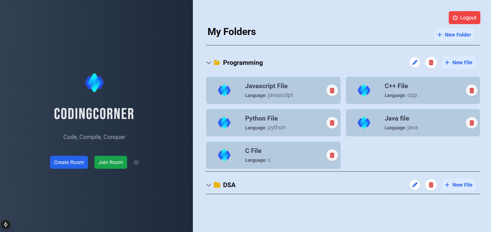
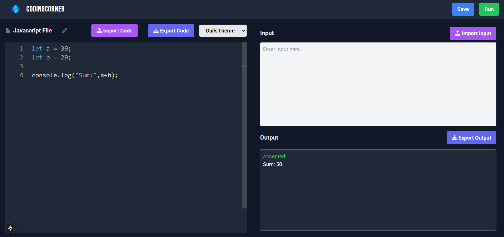
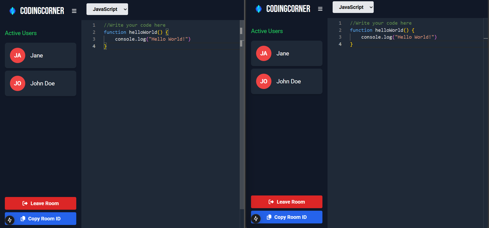

# CodingCorner

**CodingCorner** is a web application that supports real-time collaboration, allowing individual users to save files and folders to run code. This project is built using **Next.js**, **React**, **Tailwind CSS**, **TypeScript**, **Socket.IO**, **Monaco Editor**, and **JWT** for authentication and tokens.

## Features

### 🔒 User Authentication
- **Secure Login**: Users can sign up and log in using their email ID, with JWT-based authentication ensuring security.
  
### 🖥️ Real-time Collaboration
- **Create and Join Rooms**: Users can create rooms for real-time collaboration and share their room IDs with others to join the same room. Collaboration is facilitated by **Socket.IO** to enable seamless real-time communication.

### 💻 Code File Management
- **Create and Save Files**: Users can create files in 5 different programming languages: JavaScript, C, C++, Python, and Java.
- **Folders Management**: Users can create folders to organize their code files and run the code within them.

### ▶️ Code Execution
- **Run Code**: Each user can run their code directly within the platform.

### 🔄 File and Folder Renaming
- **Rename Files and Folders**: Users can rename their files or folders at any time to keep their workspace organized.

---

## Technologies Used

- **Frontend**:  
  - **Next.js**: Utilized for both frontend and backend logic, leveraging the full-stack capabilities of Next.js.
  - **React**: Used for building the user interface, with React components rendering the dynamic app.
  - **Tailwind CSS**: For styling the app with utility-first CSS classes.
  - **Monaco Editor**: Provides the code editor interface to write and edit code.
  
- **Backend**:  
  - **Next.js API Routes**: Using Next.js' built-in API routes to manage server-side functionality.
  - **Socket.IO**: For real-time communication, enabling live collaboration between users within rooms.

- **Code Execution**:  
  - **Judg0**: For executing code in various programming languages and returning results.

- **Database**:  
  - **MongoDB**: Stores user data, files, folders, and collaboration information.

- **Authentication**:  
  - **JWT (JSON Web Tokens)**: Used for secure user authentication and token management.

---

## Screenshots

Here are some screenshots of the app in action:

### Landing Page
  
### Home Page
  
*The home page where users can create or join rooms for real-time collaboration.And User can manage their folders and files*

### Code Editor
  
*The Monaco editor in action, where users can write and execute code in multiple languages.*

### RealTime Collaboration

*Enhance teamwork with real-time collaboration, allowing multiple users to work together simultaneously, share updates instantly, and stay in sync effortlessly.*

---


## Installation

### Prerequisites

Make sure the following software is installed:

- [Node.js](https://nodejs.org/en/)
- [MongoDB](https://www.mongodb.com/)
- [npm](https://www.npmjs.com/) (Node Package Manager)

### Steps to Run the Application

1. **Clone the Repository**:
   ```bash
   git clone https://github.com/Ganeshshit/codekaro/


2. **Install Dependencies**:
   ```bash
   npm install
3. **Run the Development Server**:
- Setup the environment variables in .env 
file.

   ```bash
   npm run dev
4. **Access the App**:
   - Open your browser and go to http://localhost:3000 to access the app.
